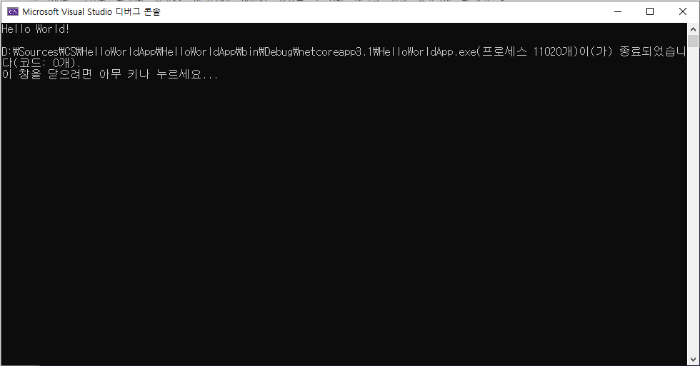

# HTML 학습 리포지토리
HTML5, CSS3, JS 학습용 리포지토리

> 마크다운(markdown)은 일반 텍스트 기반의 경량 마크업 언어이다. 일반 텍스트로 서식이 있는 문서를 작성하는 데 사용되며, 일반 마크업 언어에 비해 문법이 쉽고 간단한 것이 특징이다. HTML과 리치 텍스트(RTF) 등 서식 문서로 쉽게 변환되기 때문에 응용 소프트웨어와 함께 배포되는 README 파일이나 온라인 게시물 등에 많이 사용된다.

------------------------------

## HTML5
HTML 기본 학습

### HTML이란?
개요에 대해서 학습합니다
1. Hyper Text Markup Language 정의
1. HTML 역사 
1. HTML5의 차이점

- Hyper Text Markup *Language* 정의
- __HTML__ _역사_
- **HTML5의 ~~차이점~~**
  - UL2
    - SUL3
    - SUL4

* [X] 학습하기
* [ ] 복습하기

+ [X] 학습하기
+ [ ] 복습하기

💗💔


```csharp
using System.IO;

namespace HelloWorldApp {
  public class Program {
    public static void Main(String[] args) {
      Console.WriteLine("Hello, World!");
      // Hello World 10 WOW!!
    }
  }
}
```
```

```


```

```


참조링크
-------
- [Microsoft](https://www.microsoft.com "마이크로소프트")
- [Naver](https://www.naver.com "네이버")
- [Oracle](https://www.oracle.com "오라클")

-------------------------------

## CSS3
CSS 기본 학습

> CSS is Cascading Style Sheets.

`테스트 코드`

-------------------------------

## Javascript
Javascript 기본 학습

-------------------------------

## Responsive Web
응답협 웹 기본 학습

--------------------------------

## Project
전체 통합 프로젝트

--------------------------------
문의메일 : <personar95@naver.com>
